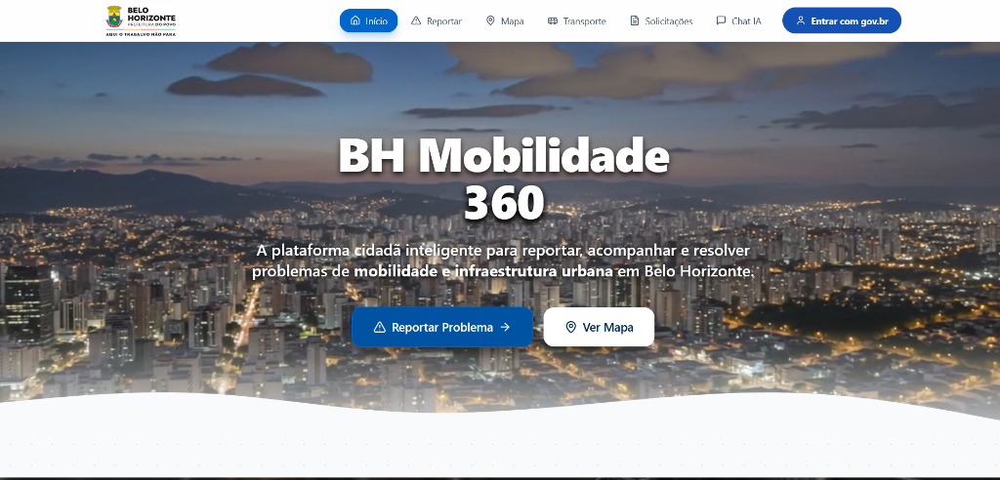

# 🏙️ BH Mobilidade 360

O **BH Mobilidade 360** é uma plataforma cidadã desenvolvida para modernizar a interação do cidadão com a infraestrutura de Belo Horizonte.

O site foi criado com o objetivo de centralizar serviços essenciais para a população em um só lugar, permitindo:
- **Reportar problemas urbanos** (buracos, iluminação, alagamentos) de forma simples e rápida.
- **Acompanhar ocorrências** da cidade através de um mapa interativo e colaborativo.
- **Consultar informações do transporte público** (Ônibus, MOVE, Metrô).
- **Acessar um Chat Integrado** para facilitar o acesso à informação de mobilidade.

---
*Projeto de demonstração desenvolvido para apresentar uma visão moderna e integrada de serviços públicos.*
